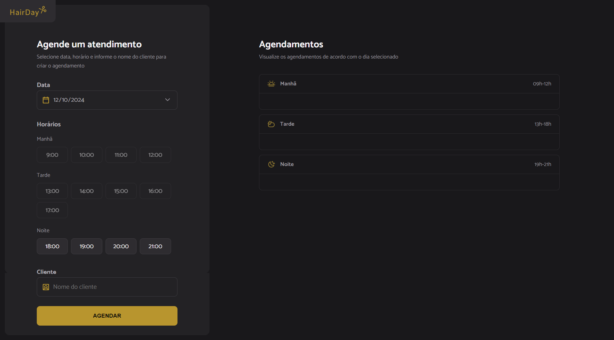

# Hairday

Hairday é uma plataforma web para agendamento de horários em um salão de cabeleireiro. Com ela, os usuários podem selecionar datas e horários disponíveis para marcar serviços, sendo que os horários já reservados se tornam automaticamente indisponíveis para novas marcações.

A aplicação permite agendamentos apenas para datas futuras, garantindo que os clientes possam visualizar e reservar apenas horários ainda válidos.

## Tecnologias Utilizadas

- **JavaScript**: Responsável pela lógica e interação da aplicação.
- **HTML5**: Estrutura e marcação da interface da aplicação.
- **CSS3**: Estilos visuais e responsividade.
- **Webpack**: Utilizado para empacotamento e otimização dos arquivos.
- **Babel**: Para transpilar o código JavaScript moderno e garantir compatibilidade com diferentes navegadores.
- **Dayjs**: Manipulação e formatação de datas para controlar as marcações de horários.
- **JSON Server**: Servidor fake usado para simular uma API REST. Pode ser executado localmente ou configurado para utilizar uma API externa.
- **MockAPI**: Utilizado para hospedar os dados do backend enquanto a aplicação está em produção.
- **GitHub Pages**: Hospedagem do frontend da aplicação.

## Funcionalidades

- **Agendar Horários**: Os usuários podem agendar um horário em um salão de cabeleireiro selecionando a data e o horário desejado. Horários e datas anteriores à atual não são permitidos.
- **Visualização de Horários Disponíveis**: Ao selecionar uma data, os horários disponíveis são exibidos. Horários já agendados são automaticamente bloqueados para novas reservas.
- **API Local (Opcional)**: A aplicação pode ser configurada para usar um servidor local (`json-server`) mudando a configuração da API para `localhost`.

## Captura de Tela



## Como Executar o Projeto Localmente

### Pré-requisitos

- Node.js instalado.

### Passos

1. Clone o repositório:

```bash
git clone https://github.com/saramargarido/hairday.git
```

2. Instale as dependências:

```bash
cd hairday
npm install
```

3. Execute o servidor local (opcional, necessário para acessar a API local):

```bash
npm run server
```

4. Inicie o ambiente de desenvolvimento:

```bash
npm run dev
```

5. Acesse a aplicação em: `http://localhost:8080`

## Hospedagem

A versão em produção da aplicação está disponível no GitHub Pages e pode ser acessada [aqui](https://saramargarido.github.io/hairday/).
